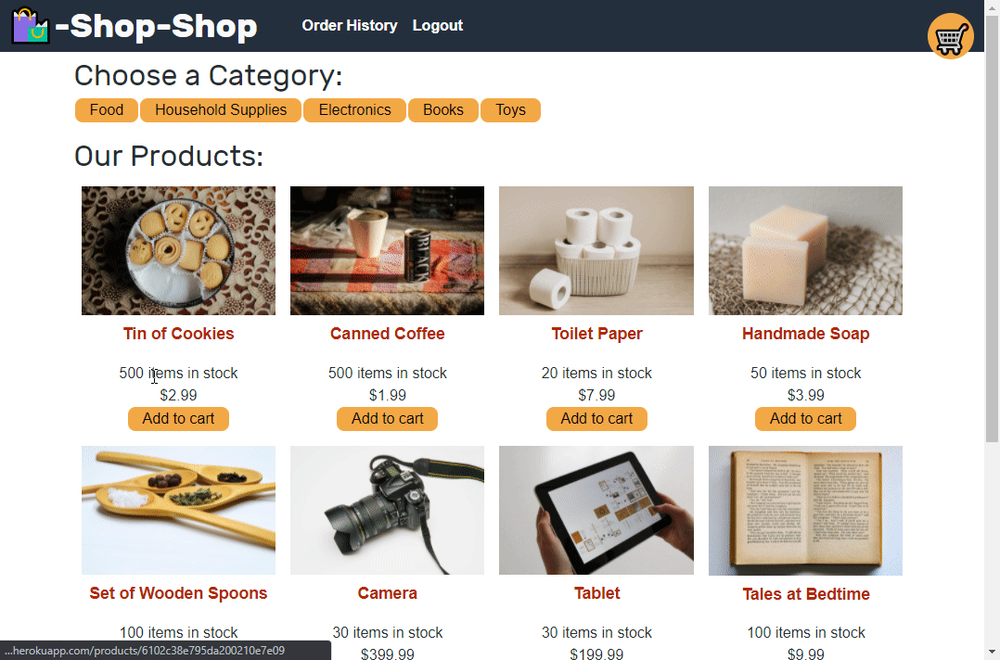

# redux-store

## Overview

Given a functional MERN e-Commerce site, the user is tasked with refactoring the application to use Redux to manage the global state. Doing so allows state management to be separated from the React lifecycle.

## Table of Contents

  - [Pseudocode](#pseudocode)
  - [Installation](#installation)
  - [Usage](#usage)
  - [Technologies Used](#technologies-used)
  - [Links](#links)
  - [Resources](#resources)

## Pseudocode

1. Install node packages of react-redux and redux in the client portion.
2. Create a store script in 'client/src/utils' and delete the globalState script.
3. Add an initial state to the reducer script.
4. Refactor components and pages that used globalState to use 'useDispatch' and 'useSelector', from react-redux, for dispatch and state, respectively.
5. Refactor the App script to also Provider react-redux that passes store as an object to store.

## Installation

- `npm i`

## Usage

- `npm run develop` to start the server.
- Click on an item's image to see more details.
- Click on a category to filter items, accordingly.
- Click on "Add to Cart" to add the item to the cart.
- In the cart, quantity can be updated or the checkout button can be clicked.

## Technologies Used

- Mongoose
- Express
- React
- Node.js
- Redux
- Bootstrap

## Links

- [Deployed Site](https://redux-store-huirayj.herokuapp.com/)
- [Repository](https://github.com/huirayj/redux-store)

## Resources

- [Redux](https://redux.js.org/basics/basic-tutorial)
